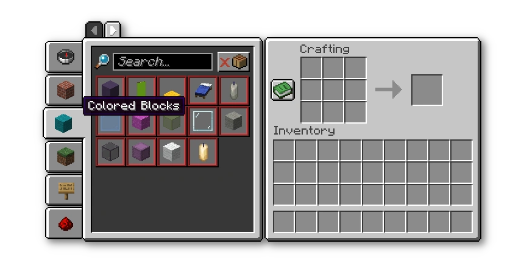

# Recipe Book is Pain

Makes the recipe book use creative tabs for groups, making it a bit more useful in modpacks.

Also adds Group Pages to support a lot more tabs.

* screenshot of the mod working with [Better Recipe Books](https://www.curseforge.com/minecraft/mc-mods/brb)